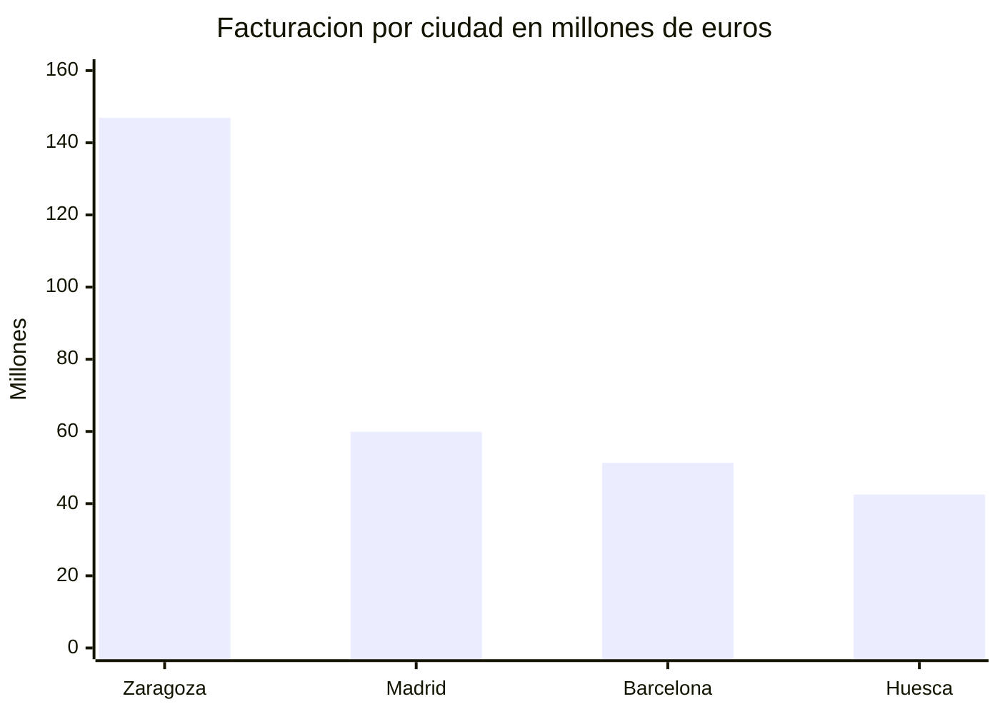
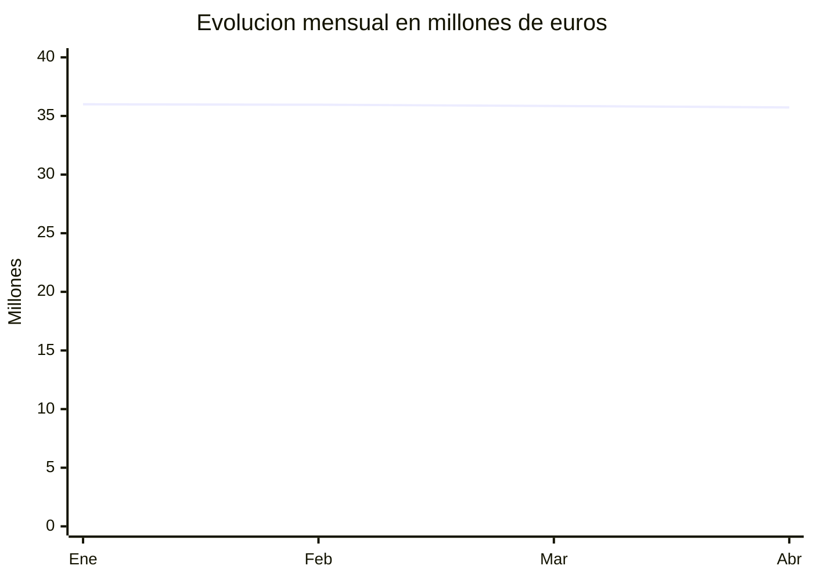
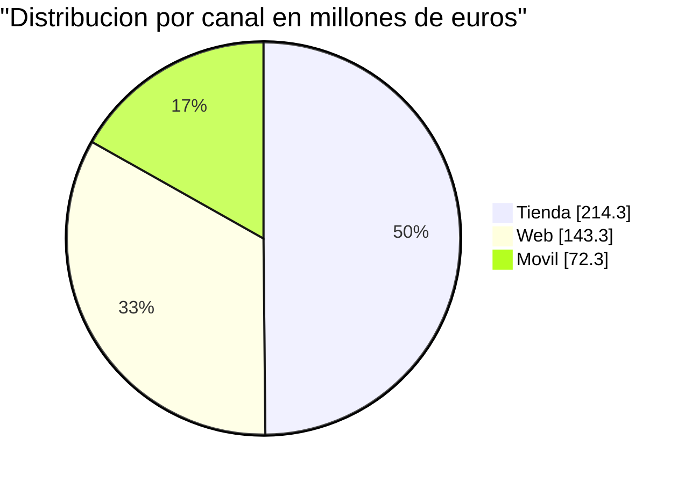
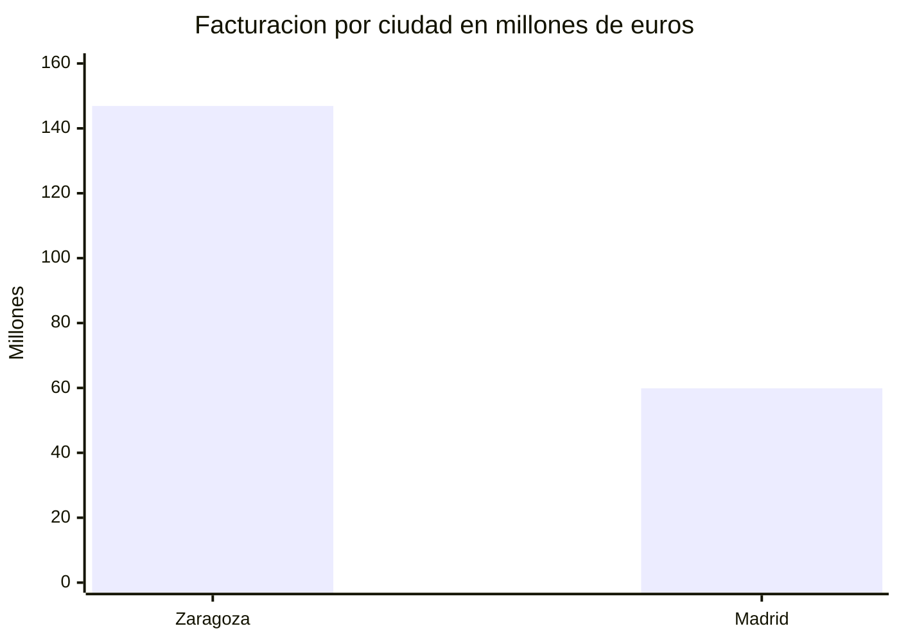

# CONTEXTO · INFORMES CON DIAGRAMAS MERMAID
## Documento para tu asistente · súbelo al RAG antes de pedirle nada
**Curso Big Data e IA Aplicada · Formación San Miguel · Zaragoza**

> **Para qué sirve.** Con esto cargado, tu asistente puede ayudarte a adaptar el prompt y a
> **arreglar un diagrama que no renderiza**. Sin esto, te propondrá sintaxis de otras versiones de
> Mermaid y tipos de diagrama que aquí no funcionan.

---

# 1 · QUÉ ES MERMAID, Y POR QUÉ SE ELIGE

Mermaid **no es una imagen: es una especificación en texto**. El renderizador dibuja los ejes; el
modelo solo escribe los números.

| | Imagen generada | Mermaid |
|---|---|---|
| Quién mide | Nadie: la máquina **dibuja** una barra | El renderizador, a escala |
| Se puede auditar | ❌ No hay nada que leer | ✅ Los números están escritos |
| Si el modelo se equivoca | Sale bonito y falso | Se ve al instante |

> 🎯 **Esa es toda la razón.** Un PNG con una barra mal proporcionada es indistinguible de uno bien
> hecho. Un `bar [146.9, 51.3]` se compara con el párrafo en cinco segundos.

---

# 2 · QUÉ RECIBE EL MODELO

Un JSON con **cifras ya verificadas**. Nunca datos crudos.

```json
{
  "operaciones":       999535,          <- ENTERO, sin decimales
  "facturacion":       429892547.06,
  "ticket_medio":      430.09,
  "clientes_activos":  99996,
  "por_canal":  [{"canal": "tienda",  "millones": 214.3}, ...],
  "por_ciudad": [{"ciudad": "Zaragoza", "millones": 146.9}, ...],
  "por_mes":    [{"mes": "2025-01", "millones": 36.0}, ...]
}
```

**Cambia con los filtros.** Por eso el prompt no lleva cifras dentro.

---

# 3 · ⚓ LAS ANCLAS · y cómo detectan un filtro

| Sin ningún filtro | Valor |
|---|---|
| Operaciones | **999.535** |
| Facturación | **429.892.547,06 €** |
| Ticket medio | **430,09 €** |
| Clientes activos | **99.996** |
| Canal, en millones | tienda **214,3** · web **143,3** · movil **72,3** |
| Ciudades, en millones | Zaragoza **146,9** · Madrid **59,9** · Barcelona **51,3** · Huesca **42,5** |

Si el CONTEXTO no trae esas cifras, **hay filtros** y el informe debe decirlo en el título.

---

# 4 · LA SINTAXIS QUE FUNCIONA · solo estos tres

Cuantos menos tipos, menos errores. **No uses `flowchart`, `gantt`, `graph` ni `timeline`**: son los
que más fallan y ninguno aporta nada que estos tres no den.

## Comparar categorías



## Evolución temporal



## Reparto sobre un total



---

# 4b · TODO DIAGRAMA VA CON SU TABLA

El diagrama da **la forma**; la tabla da **el número**. Y con Mermaid hay un motivo añadido: el
diagrama lleva los números **con punto decimal**, porque la sintaxis lo exige. La tabla los devuelve
a la notación española.

````


| Ciudad | M€ |
|---|---|
| Zaragoza | 146,9 |
| Madrid | 59,9 |
````

> 🎯 **«Un gráfico que no enseña su tabla es una opinión.»** Y aquí, además, **comparar los dos
> detecta el error de la coma decimal**: si el array tuviera cuatro valores y la tabla dos, salta a
> la vista.

---

# ⚠️ LA CIFRA CON UN DÍGITO DE MÁS

El fallo más peligroso que hemos visto no fue de formato. En una prueba, el modelo escribió
**999.996 clientes activos** donde el contexto decía **99.996**. Tres veces. Y después calculó un
ratio a partir de esa cifra.

| | |
|---|---|
| Lo que decía el contexto | `"clientes_activos": 99996` |
| Lo que escribió el informe | **999.996** clientes |
| Lo que derivó de ahí | «429,91 € de facturación por cliente» — con el dato bueno son **4.299,10 €** |

**Un dígito de más no chirría.** La cifra sigue teniendo pinta de cifra, el ratio sigue saliendo, y
la frase se lee bien. Nada avisa.

Por eso la regla **C9** obliga a un repaso final: cada cifra del informe, o está literalmente en el
contexto, o es una división escrita al lado. Y por eso, en el aula, **la auditoría contra el ancla
no es un trámite**: es lo único que separa un informe correcto de uno que parece correcto.

---

# EL COLOR · cómo se usa sin que sea adorno

El cuadro de mando entiende la sintaxis de color de **Streamlit**, también dentro de las tablas:

```
:red[texto]   :green[texto]   :orange[texto]   :blue[texto]   :gray[texto]
```

| Color | Símbolo | Qué significa |
|---|---|---|
| Azul | ⚓ | Cifra ancla: los totales del alcance, ya verificados |
| Verde | ▲ | Lidera el grupo o está por encima de la media |
| Rojo | ▼ | Cierra el grupo, está por debajo, o exige acción |
| Naranja | ● | Al límite: menos de un 2 % de diferencia con otra del grupo |
| Sin color | — | Cifra de contexto. **La mayoría van así** |

## Las tres reglas que evitan que se vuelva un adorno

**El símbolo es obligatorio, el color no basta.** Fuera del cuadro de mando —en el `.md`
descargado, en GitHub, en un cuaderno— `:green[▲ 214,3]` se ve en crudo. **El ▲ sobrevive y el
informe se sigue leyendo.** Y hay un motivo más: nadie debería depender del color para entender un
dato.

**Dos o tres en el párrafo, dos filas en la tabla, y la leyenda una sola vez.** Es la misma lección del ⚠: un aviso que salta
siempre deja de avisar. Un informe con todo coloreado es un semáforo averiado.

**El criterio se escribe al lado, con el número.** No *«está en verde»*, sino *«está
:green[▲ 214,3 M€], un 49,9 % del total»*. El color señala; el número justifica.

---

# 5 · LOS ERRORES DE SINTAXIS, POR FRECUENCIA

| Nº | Qué se escribe mal | Qué pasa |
|---|---|---|
| !**1** | `|` dentro de una etiqueta | `Parse error … got 'PIPE'`. **El más común con diferencia** |
| !**2** | Coma decimal: `bar [146,9, 51,3]` | **No da error**: lee cuatro valores en vez de dos. El peor de todos |
| **3** | Etiqueta sin comillas con acento, paréntesis o `€` | Parse error, o etiqueta cortada |
| **4** | Menos valores en `bar` que etiquetas en `x-axis` | Barras desplazadas, sin aviso |
| **5** | `y-axis "Millones" 0 -> 160` | La flecha es `-->`, con dos guiones |
| **6** | Un tipo no soportado (`flowchart`, `gantt`) | Renderiza mal o revienta |
| !**6b** | **Dos magnitudes en el mismo eje** | No revienta. Dibuja personas y transacciones juntas como si compararan |
| !**6c** | **Diagrama Y «Sin gráfico» a la vez** | Se contradice en dos líneas. Son excluyentes: o una cosa o la otra |
| **6d** | **Cambiar de unidad para forzar la comparación** | Convertir 999.535 operaciones en «1.0 millones» para ponerlas junto a los euros sigue siendo comparar magnitudes distintas |
| **6e** | **Eje truncado a números redondos** | 34 → 38 deja el rango en el 15 % de la altura. Con 35,37 → 36,23 ocupa el 71 % |
| **7** | Tabulaciones en vez de espacios | Parse error en algunos renderizadores |

> ⚠️ **El nº 2 es el que hay que vigilar de verdad**, porque **no protesta**. El diagrama sale, con
> las barras equivocadas. Todo el informe escribe los números a la española: en cuanto esa costumbre
> se cuela dentro del array, tienes un gráfico falso que parece correcto.

---

# 6 · EL EJE Y · dónde está la trampa honesta

**Arranca en 0 siempre**, salvo con series planas. Con doce meses entre 35,49 y 36,11 —una
dispersión del 1,7 %— un eje desde 0 da una línea recta que no informa.

La solución es acotar el eje… **con el margen tomado sobre el RANGO, no sobre el valor**:

| Cómo se acota | Eje | El rango ocupa |
|---|---|---|
| 5 % sobre el valor | 33,0 → 38,0 | **12 %** · sigue plana |
| !20 % sobre el rango | **35,37 → 36,23** | **71 %** · ahora se ve |

```
rango = máx - mín        desde = mín - rango * 0,2        hasta = máx + rango * 0,2
```

Y hay que **avisarlo debajo**:

> *«Eje truncado para hacer visible una variación del 1,7 %.»*

**Un eje truncado sin avisar es la forma más elegante de mentir con datos correctos.** Con el aviso,
es exactamente lo que hay que hacer.

---

# 7 · LO QUE EL MODELO NO SABE

**No sabe qué NO tiene:** ni costes, ni márgenes, ni campañas, ni stock, ni competencia.

**No distingue magnitudes.** Para el modelo, 99.996 clientes y 999.535 operaciones son dos números
y los pondrá en el mismo eje si le dejas. La prueba: ¿qué escribirías en la etiqueta del eje Y? Si
la única respuesta honesta es «unidades», son magnitudes distintas y no hay gráfico.

**No sabe que los datos son sintéticos.** Leerá la regularidad mensual como un rasgo del negocio.

**No sabe qué filtros tienes puestos.** Solo ve cifras. De ahí la detección por ancla.

---

# 8 · EL PROMPT QUE LE PASAS PARA ADAPTAR EL TUYO

```
ROL
  Eres experto en visualización de datos y conoces la sintaxis de Mermaid.

CONTEXTO
  (adjunta este documento y el PROMPT_B_informe_mermaid.md)

TAREA
  Adapta el prompt para que <lo que quieras cambiar>, manteniendo intactas
  las reglas de ALCANCE y las reglas M1 a M8.

FORMATO
  El prompt completo, listo para pegar. Sin explicaciones alrededor.

EJEMPLO
  (pega el bloque de sintaxis M5 del prompt B)
```

## Y si un diagrama no renderiza

```
ROL      Depuras diagramas Mermaid.
CONTEXTO (adjunta este documento)
TAREA    Este diagrama da el error <pega el error>. Dime QUÉ regla de la
         sección 5 incumple y devuélvelo corregido.
FORMATO  La regla incumplida, y el diagrama entero corregido.
```

> **Fíjate en el «qué regla incumple».** No pidas «arréglalo»: pide que **nombre el error**. Si sabe
> nombrarlo, lo ha entendido; si solo lo arregla, has aprendido tú nada.

---

*Contexto para informes con Mermaid · Formación San Miguel · Zaragoza*
